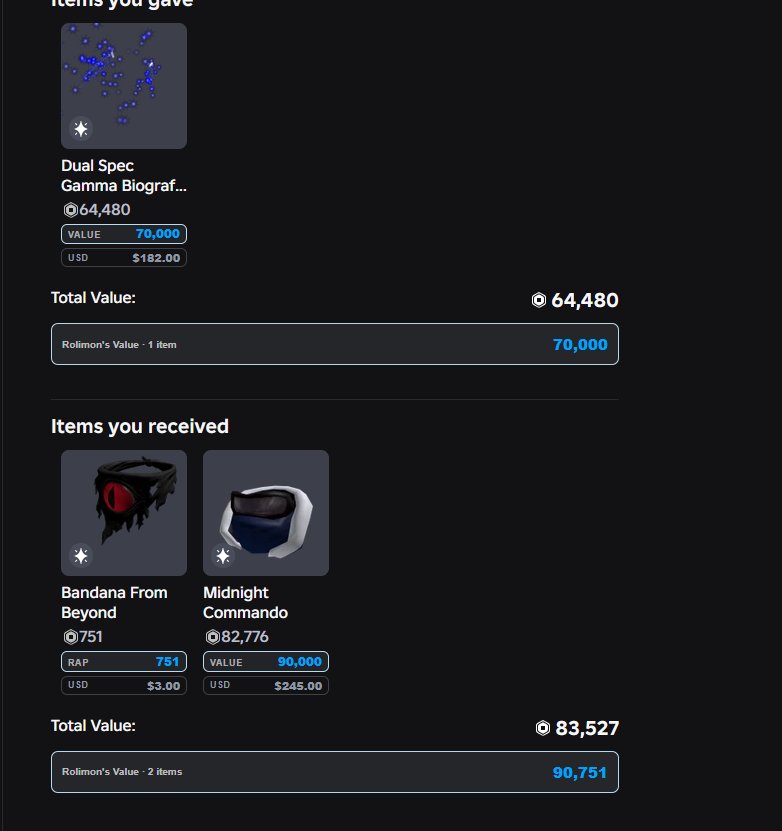
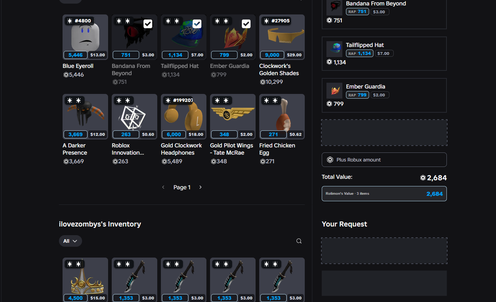

couldn't find a fully trusted firefox extension with these features for roblox trading, so i decided to make it. and it's entirely free no fees no review requirement. everything added will be free

## Screenshots

## Installation for developers

To install the extension in Firefox:
(put it in a zip file first, you can use 7zip for this.)

1. Open `about:config` in Firefox.
2. Search for `xpinstall.signatures.required`.
3. Set it to `false`.
4. Open `about:addons`.
5. Click the **gear icon** and select **Install Add-on From File...**
6. Select the extension file (`.xpi or .zip`).
7. Follow the prompts to complete the installation.

Once you are done testing, you can set `xpinstall.signatures.required` back to `true` to restore Firefox's default security protection.

> **Note:** Firefox normally requires extensions to be signed. Only disable signature verification when installing a trusted development or unsigned build.
